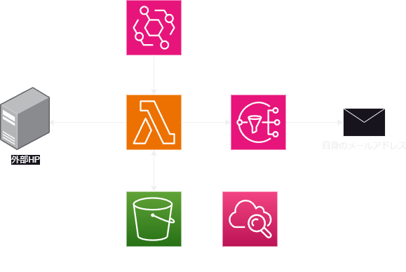
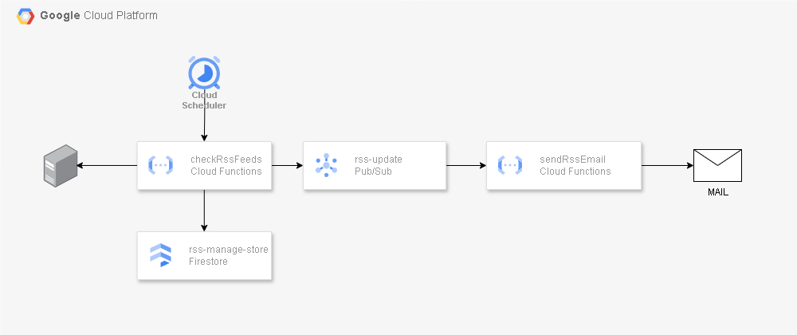

# RSS でのサイト変更を各クラウドで検知してみる
サーバレスで作成し定期的にサイトのRSS情報を確認し変更があれば通知する

参考記事：https://zenn.dev/waddy/articles/cloud-run-functions-zenn-rss-to-pubsub

# 方針
- クラウドインフラはterraformで書く
- CICDはGithub Actionsで作成する
- 処理はPython3.12で実装する

# AWS
## 構成図

# GCP
## 構成図

